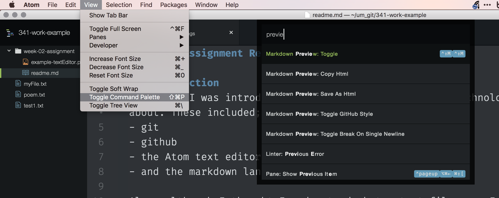
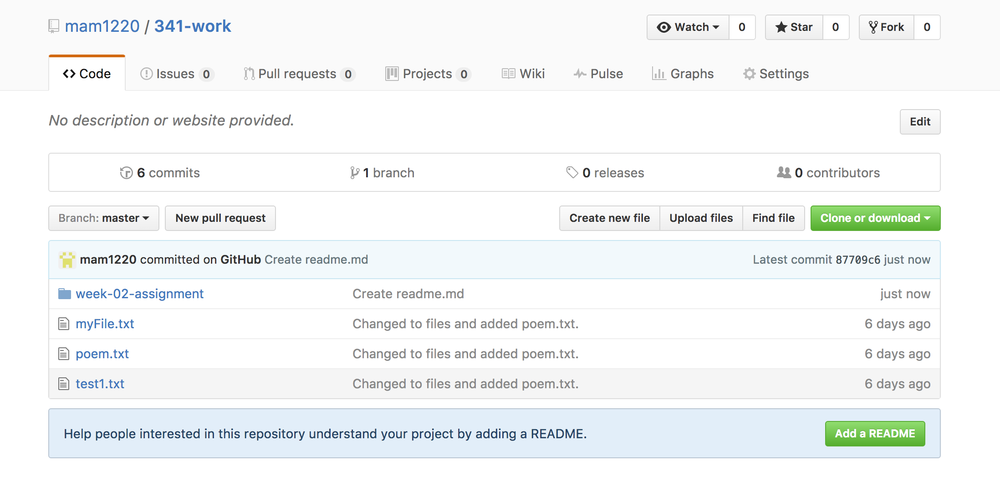
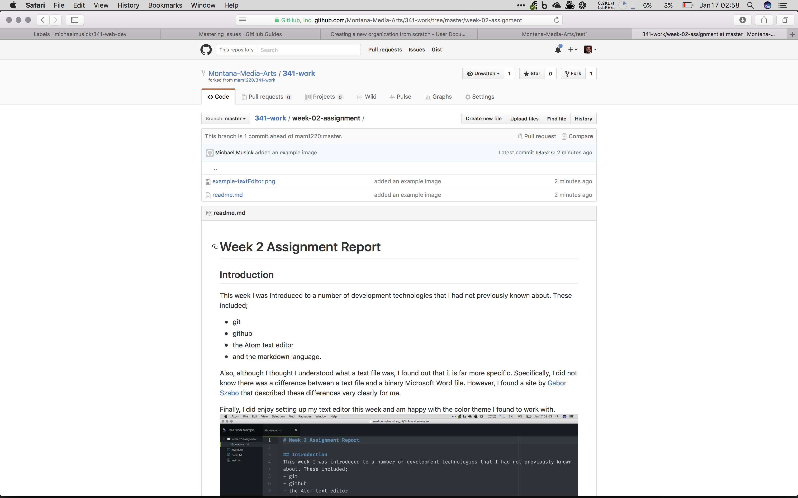

# Markup and the Markdown (`.md`) language.

A markup language is a system for annotating a document in a way that is syntactically distinguishable from the text.
Markup languages tend to encourage writers to focus on content and structure before concerning themselves with presentation.
Structure is defined for a processor through the use of tags embedded directly in the text.

One of the original markup languages, and one which you will be using extensively as a web developer during this course is HTML or HyperText Markup Language. (NOTE: we will wait until next week before we begin examining this specification.) This week, we are going to start with another, slightly simpler, and very popular markup language known as Markdown.

Just as HTML, markdown files encourage the writer to focus on content and structure, as opposed to formatting. In fact, this entire course has been developed for the web using markdown files.

A markdown file typically uses the `.md` extension. This file type allows the writer to identify portions of the text as headers (at various levels), paragraphs, bold, italic, links, code, lists, and tables. It also allows the writer to easily include images through links in the document. Below is an example of markdown. There is also an image showing markdown text in the left of an Atom pane, and the markdown preview in the right Atom pane.

```markdown
# THIS IS A LEVEL 1 HEADER
## THIS IS A LEVEL 2 HEADER
### THIS IS A LEVEL 3 HEADER

This is a paragraph. This paragraph requires no extra markup to signify it as such.

An empty line between text blocks signifies a new paragraph.

To mark certain words as bold we surround them with two **asterisks**. To mark certain words as emphasized or italic we surround them with a single *asterisk*.

Link text is placed between square brackets, and the associated URL link follows between parenthesis. [This is an example link](https://michaelmusick.com)

Similar to links, images are added with an exclamation mark, followed by square brackets with an image description, finally followed by the exact or relative url to the image in paranthesis. 

We can identify code in a paragraph using the back-tick character. The back-tick is the leftmost key on number line, below the esc key on most American keyboards. `var Der = 20`.

We can write code blocks by surrounding our lines of code with three backticks. After the opening set of backticks, you should write the language you are writing (ie. markdown, html, css, javascript). See [https://help.github.com/articles/creating-and-highlighting-code-blocks/] for more info.

Lists are simply line items prepended with dashes to create an unordered list or numbers to create an ordered list.
- list item 1
- list item 2

1. List item 1
2. List item 2

Lastly, you can further extend markdown with HTML. This is particularily useful for adding embedded videos from [YouTube](youtube.com). You will be shown how to do this in the coming weeks.
```


### { TODO: }
Copy the above code/text. Then paste it into a new Atom file that you save as `test2.md`. (It does not matter where you save this file, you are free to delete it immediately after this TODO example)

Now in Atom, open the Command Palette (macOS: Cmd + shift + p).


Then start to type “preview” until “Markdown Preview: Toggle” is seen. Select this option by clicking it or pressing return. This will show you the rendered version of the markdown code, as shown in the below image.


(NOTE: you may also want to open Atom preferences and tell the Markdown Preview Package to render using “Github Style”.)

## Difference between Microsoft Word and markdown?
As mentioned previously, one of the main differences between a a markdown (or more generally, text document) and a Microsoft Word file is that the former is stored as text, and the latter is stored as binary code. Microsoft does this for a number of reasons, one of these is to keep their product proprietary. This binary file also allows for syntax and structure to be stored within the document file, without the user having to see it in the text itself.

The image below shows a word document in which certain sections have been styled using Word’s “styles”.


## Markdown Cheat Sheet
There are many markdown resources to make writing markdown files easier. In Atom there are numerous markdown packages, such as markdown-writer, which allows you to call instructions from the command palette (Cmd + Shift + P). One great thing about Atom is that you can preview what the rendered text will look like by opening the command palette and pulling up the ‘markdown preview’ (as in the above image). There are also specialized markdown writers such as [iA Writer](https://ia.net/writer), [Ulysses](https://www.ulyssesapp.com) and Byword, all of which include tools to simplify the writing process and preview the file.

These tools are all wonderful, and you may find them useful. But, what you need first, is a simple markdown cheat sheet, which tells you what symbols you need to use to specify structure and syntax. A google search will return a number of useful results.  However, I would suggest you start with the [GitHub cheat sheet](https://github.com/adam-p/markdown-here/wiki/Markdown-Cheatsheet)and [Mastering Markdown by GitHub](https://guides.github.com/features/mastering-markdown/).

## Markdown and GitHub.com
GitHub.com uses markdown extensively within its ecosystem for documentation, readme files, as well as allowing for issues to be written using markdown. For every homework assignment you submit, you will also write a short report in markdown. This report will need to discuss a number of things every week;

1. Summarize the work you did this homework cycle. Paying particular attention to the individual choices you made.
2. What steps did you take to complete the assignment?
3. Did you have any problems or issues? How did you solve these? Did you post about these to the class repo issue tracker? Did you receive any useful feedback from your classmates?
4. Is there anything in particular you learned that you would like to discuss further?
5. What issues did you help your fellow classmates out with this past homework cycle?

You will submit a link to this file in your GitHub repo via the class repo wiki page.


<h2 id="hw2todo">{ TODO: }</h2>

### 1: Write your `readme.md`

- On your development machine, create a new directory in your repo. Label this directory as `week-02-assignment`.
- In this directory, create a new document labeled `readme.md`. (This can be done in finder, explorer, command line, or your text editor) GitHub.com automatically renders readme.md files within individual directories.
- Open this file in a text editor application.
- The first line of text should be your name and class section. ie `Nick Moles 50`
- Using appropriate markup-syntax, discuss your work for the week according to the 5 prompts from the above section.
- You should have at least one of each of the following elements in this document (NOTE: One instance of some of these elements will be insufficient.)
	- Header Level 1
	- Header Level 2
	- An un-ordered list
	- An ordered list
	- A link to another site
	- Inline code (i.e. using single backticks [code quote example](https://help.github.com/articles/basic-writing-and-formatting-syntax/#quoting-code)) or a multi-line code block (i.e. using three backticks at the top and bottom. [Code block example](https://help.github.com/articles/creating-and-highlighting-code-blocks/))
- Finally, you should include a picture of your markdown file within your text editor. To do this;
	- Take a screen shot of your editor from your computer. ([How to take a screen shot on macOS](https://support.apple.com/en-us/HT201361), [How to take a screen shot on Windows](https://www.cnet.com/how-to/how-to-take-a-screenshot-in-any-version-of-windows/))
	- Move the image to the `week-02-assignment` directory.
	- Embed the image in your document using the following code; ``.

NOTE: Please edit, spell-check, and re-read your writing. Unfortunately, you will be marked down for poor writing.

### 2: Commit you changes and push them to the GitHub repo
First, when you are finished with your write up, I want you to move the test1.txt file from earlier in this weeks work to this same new child directory (`/341-work/week-02-homework/test1.txt`).

When you are finished with your write up and moving the file, you should ‘stage’ this new `readme.md` file, along with the image file, and changed `test1.txt` in your Git repo. Commit these files to the repo, then push your changes to the GitHub server.

(NOTE: If you are uncomfortable with this, review the steps from the previous page)

### 3: Add a Link
After pushing the commits, navigate to your repo on GitHub.com in your browser. You should see the new directory in the file list.


Click on the new directory (`/week-02-assignment`) to see its contents. You should see the readme file and the image file. Additionally, below the file list, you should the contents of the `readme.md` file rendered and presented.



In your browser, select and copy the entire URL for this page from the URL/Search field box.


To add your link you will do the following;

- Navigate to the [course repo](https://github.com/Montana-Media-Arts/341-work)
- Select the ‘[wiki](https://github.com/Montana-Media-Arts/341-work/wiki)’
- Open the [HW-2 Wiki Page](https://github.com/Montana-Media-Arts/341-work/wiki/Week-2-HW)
- Click the ‘edit’ button.
- Under the “## Student Submissions” section, add your name and a link to your readme page. (i.e. “`- Michael Musick [markdown readme](https://github.com/Montana-Media-Arts/341-work/tree/master/week-02-assignment)`”
