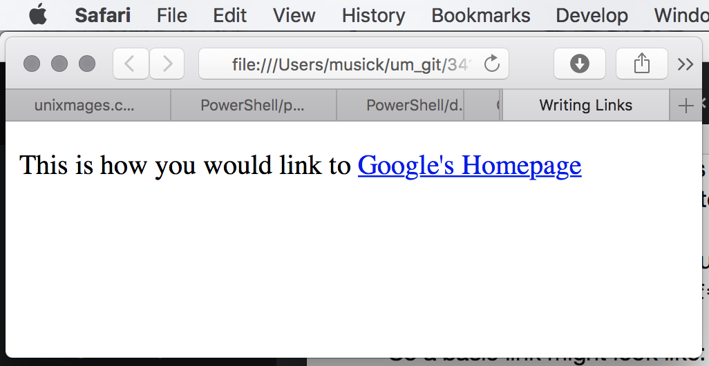
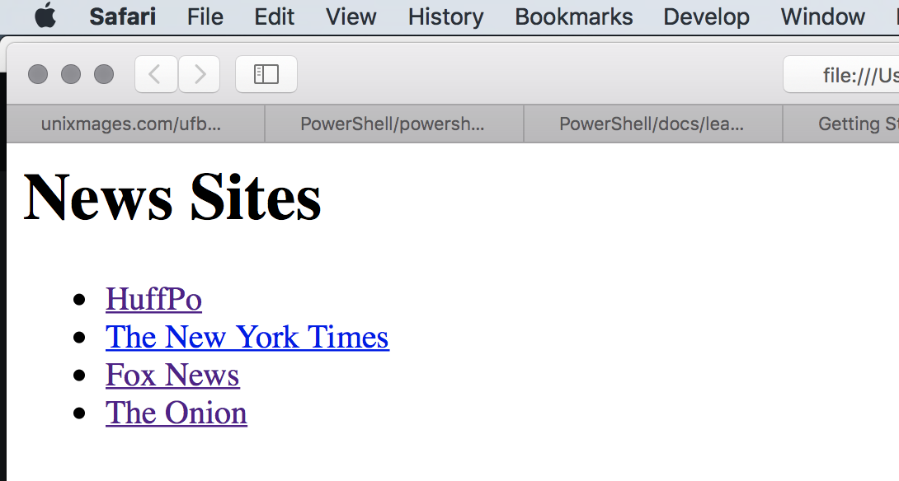
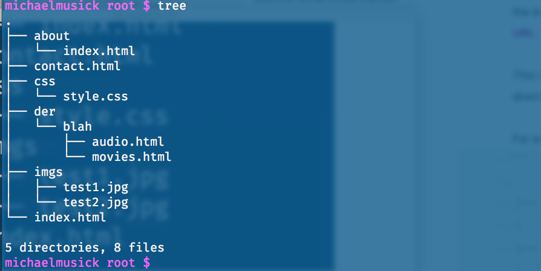

# Linking
One of the primary reasons for the Internet was to be able to easily reference research when citing others, with an ability to directly “link” to their work.

In computing, a hyperlink, or simply a link, is a reference to data that the reader can directly follow either by clicking, tapping, or hovering. A hyperlink points to a whole document or to a specific element within a document. Hypertext is text with hyperlinks. The text that is linked is called anchor text. A software system that is used for viewing and creating hypertext is a hypertext system, and to create a hyperlink is to hyperlink (or simply to link). A user following hyperlinks is said to navigate or browse the hypertext. [<sup>\[1]</sup>](https://en.wikipedia.org/wiki/Hyperlink "Wikipedia - Hyperlink")

## { TODO: }
Please read the [W3-Consortium’s document specifying the use of Links](https://www.w3.org/TR/html401/struct/links.html "W3-Consortium - Links").

## Using Links
With links being such a basic and historical part of the Internet, they  also have a very simple tag; `<a>...</a>`. Any text between a hyperlink element’s tags will be display as “hypertext”. Traditionally, this has been blue, underlined text, visually signifying to the user that the text is a link.

In order to link to another document, the author must include a hyper-reference attribute within the opening tag. This attribute is signified with `href=""`.

So a basic link might look like:

```html
<p>This is how you would link to <a href="https://google.com">Google's Homepage</a><p>
```


### A Word About Style
Link text should be specific about where the user will be going if they click a link. This means that links should not be simple text such as [click me!](#). Instead, good style would dictate that the link text be a description of the site, name, or information that informs the user.

### External Links - HTTP/HTTPS
Notice in the above link that it includes “`https`”. The “`https`” is required to signify to the browser that this is an ‘external’ link outside of the current document’s directory/server. You must include either “`http`” or “`https`”. The former is a older, established, version of the “hypertext transfer protocol”, which specified how data was sent between clients. The latter, is a “secure” version of this protocol. Whenever possible, you should provide “`https`” links (just check that they work first), as it provides a safer browsing experience.

Links that include the “`http/https`” as part of the entire URL are known as **_absolute URLs_**.
As a reminder, **_URL_** stands for “Uniform Resource Locater.” This is cross referenced by an ISP, which then provides an IP address for the URL.
Remember that the first part of the URL, or the "domain name" is the base path. Any additional pages are specified after the generic domain ".com, .edu, .org, etc". Just as in the sites you created last week.

```html
<p>
<h1>News Sites</h1>
<ul>
    <li><a href="http://www.huffingtonpost.com">HuffPo</a></li>
    <li><a href="https://www.nytimes.com">The New York Times</a></li>
    <li><a href="http://www.foxnews.com">Fox News</a></li>
    <li><a href="http://www.theonion.com">The Onion</a></li>
</ul>
</p>
```


### Opening Links in a New Window
The 'target' attribute provides us a way of specifying to a browser that a link should be opened in a new window.
In this case, the attributes value should be set to "_blank". _

```html
<p>
    <a href="https://www.google.com" target="_blank">Google Search</a> (opens in new window)
</p>
```

## Linking to Other Pages on the Same Site
When linking to other pages within the same site, you do not need to specify the domain name in the URL. You can use a shorthand known as **Relative URL**.

This is the relative file path to additional pages in the top level directory or sub-directories.

For example, if your directory structure looked like the following:

```
.
├── about
│   └── index.html
├── contact.html
├── css
│   └── style.css
├── der
│   └── blah
│       ├── audio.html
│       └── movies.html
├── imgs
│   ├── test1.jpg
│   └── test2.jpg
└── index.html
```


Then you might have a navigation bar with the following code:

```html
<ul>
    <li><a href="index.html">Home</a></li>
    <li><a href="about/index.html">About</a></li>
    <li><a href="movies/der/blah/movies.html">Movies</a></li>
    <li><a href="contact.html">Contact</a></li>
</ul>
```

- _Home_ links to `index.html` in the root directory, which should be the sites main homepage. 
- _About_ links to the index file in the sub-directory of root.
- _Movies_ will link to the `movies.html` file two sub-directories down. 
- _Contact_ links to the `contact.html` document in the top-level of the directory. 

Please visit [https://montana-media-arts.github.io/341-work/lectureCode/week4/03\_linkSameSite/](https://montana-media-arts.github.io/341-work/lectureCode/week4/03_linkSameSite/) for a live example. 

You can see the code in the 341-work repo under lectureExamples. [https://github.com/Montana-Media-Arts/341-work/tree/master/lectureCode/week4/03\_linkSameSite](https://github.com/Montana-Media-Arts/341-work/tree/master/lectureCode/week4/03_linkSameSite)

NOTE: Relative URL's help with building a site locally before pushing it to the web. This way you can develop on your local machine, and still have links to pages be valid.

## Linking to a Specific Part of the Same Page
We can use the id attribute in HTML to create links to specific portions of a page.

One attribute that can be assigned to almost any HTML element is `id`. This attribute is used to assign unique identifiers to each element, so that those specific elements can be referenced through HTML, CSS, or JavaScript. When assigning an element an id, you should ensure that no other element is given the same. 

To assign an element an unique identifier, you should include the following code in the opening tag. 

```html
<h1 id="first_heading">
```

**NOTE: **ID’s should be treated like variables in other languages, with regards to the naming conventions. If you would like a refresher on [HTML Attributes, please read w3schools page about the subject](http://www.w3schools.com/html/html_attributes.asp). 

With regard to naming conventions, please consider the following:

1. The value (i.e. `name=“value”`) should be surrounded by double quotes. 
2. For ID’s, the value should start with a lowercase letter (i.e. a-z).
3. ID’s can contain lowercase letters, uppercase letters, numbers, and some special characters (although the latter should typically be avoided).
4. ID’s should be explicit and clear with regard to what they are referencing. (i.e. “firstSection”, “aside-paragraph”, “hero\_image”. )
5. Try to avoid abbreviations for words in ID’s. (i.e. “first-paragraph” vs. “firPara”)
6. When creating ID’s that are multiple words, you should follow one of three conventions. Additionally, you should follow this convention in all of your code, so that there is consistency to your work and style.  
	-  _camelCase_; [Camel Case](https://en.wikipedia.org/wiki/Camel_case) pushes multiple words together into a single word, capitalizing the first letter of every word (except for the first word).
	- _hyphen-separated_; Each word is separated by a hyphen (`-`) character.
	- _underscore\_separated_; Each word is separated with an underscore ( \_ ) character. 

To link to an HTML element with an assigned id, simply use the id in the hyper-reference (`href`), prepended with a hashtag character (`#`).  In the following code, the link in line 1, would connect to the `h2` element in line 2. 

```html
<a href="#conclusions">Conclusions</a><br />
<h2 id="conclusions">Conclusions</h2>
```

For a live example, visit: [https://montana-media-arts.github.io/341-work/lectureCode/week4/03\_linkInPage/linking-to-a-specific-part.html](https://montana-media-arts.github.io/341-work/lectureCode/week4/03_linkInPage/linking-to-a-specific-part.html). Notice how the links take you between sections of the page?

The code for this example is in the class repo; [https://github.com/Montana-Media-Arts/341-work/blob/master/lectureCode/week4/03\_linkInPage/linking-to-a-specific-part.html](https://github.com/Montana-Media-Arts/341-work/blob/master/lectureCode/week4/03_linkInPage/linking-to-a-specific-part.html)